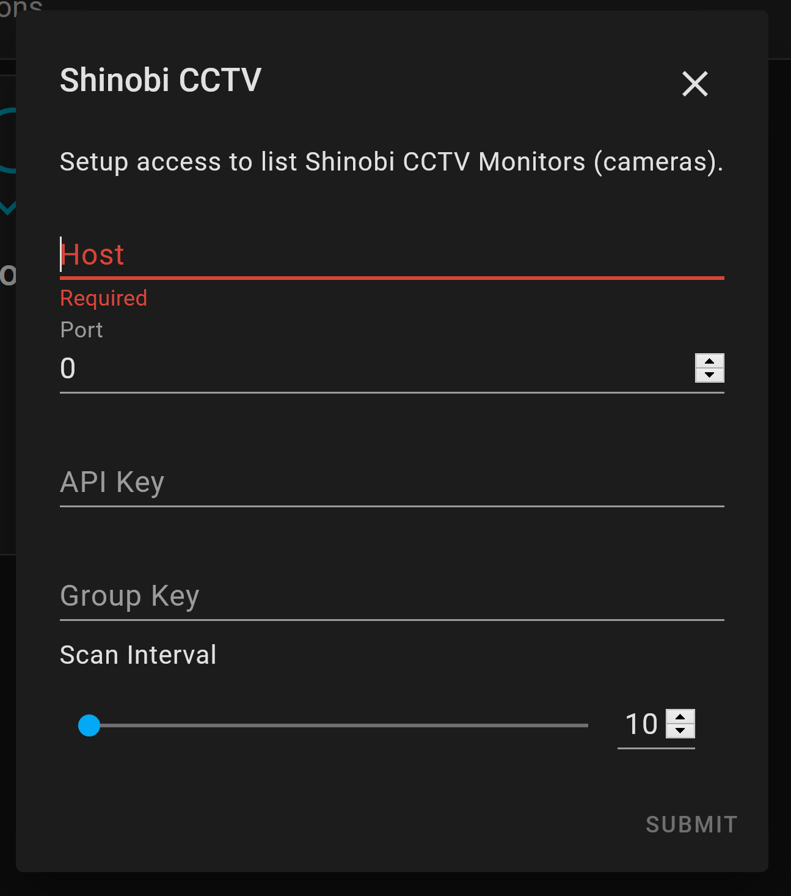
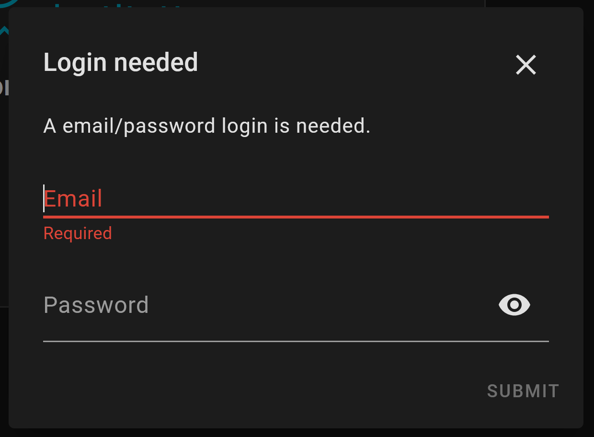

# ha_shinobicctv

Shinobi CCTV Home Assistant Integration

## How it works

This custom component adds a support for Shinobi CCTV monitors to show up as camera entities in home assistant.

## Installation

Entities for this custom component are installed via the add integration button on the integrations tab in the configuration window.

### Setup

The host field is the only required field, however an API key and Group key are needed for the integration to function. IF you know/have both keys you can provide them here, otherwise you will be prompted with another screen to provide a username and password to authenticate with, and an API key and group key will be generated for you.

An API key created this way will have the default permissions of the login used. IF you want to have custom permissions, you should pre-generate an API key and provide it on the first screen along with the correct group key.